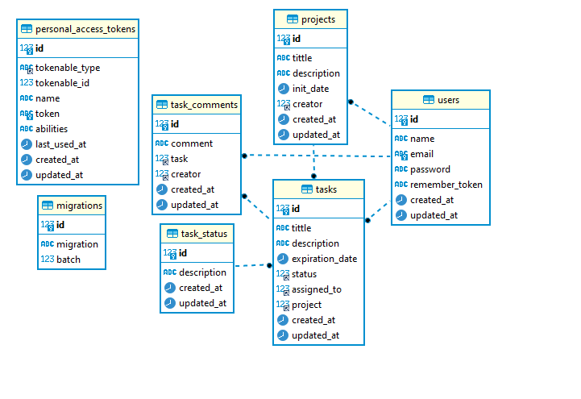

# 📃 Documentación 📃
En este apartado se encontrara una breve explicación de la aplicación, como configurar y levantar la misma y su modelo y diccionar de datos.

## 🕵️‍♂️ Sobre la prueba 🕵️‍♂️

La aplicación fue contruida en Laravel utilizando sus funcionalidades de autenticación y vistas (Blade) junto con un modelo MVC para facilitar el desarrollo por su agilidad al momento de la creacipon de los diferente modulos.

## 📘 Explicación breve de la aplicación 📘

El usuario podra registrarse y loguearse, este podra crear royectos los cuales contienen (Titulo, descripcion). UN proyecot puede contener varias tareas, las cuales tambien pueden ser gestionadas (Lo que es un CRUD) ademas de que podra comentar las tareas con observaciones sobre la misma al momento de visualizar el detalle de la tarea.

## 🔧 Configuraciones a tener en cuenta 🔧

Debe seguir las siguientes configuraciones para un correcto levantamiento de la aplicación.

- Bajar el proyecto del repositorio **[taskManagement](https://github.com/Anvidneo/taskManagement)**.
    - Utilizar el comando git clone "url" para bajar el proyecto
- Pegar en el `.env` el contenido del `.env.example`
- Tener un entorno MySql en ejecución (Se puede usar Xampp, Wampp, etc)
- Crear una base de datos llamada  `crud`

## 🔨 Levantar el proyecto 🔨

Siga las siguientes intrucciones para levantar y correr la aplicación

- Correr el siguiente comando para que se ejecuten las migraciones y se siembren los datos `php artisan migrate --seed`
- Una vez ejecutaod el paso anterior ya solo es levantar el proyecto con el siguiente comando  `php artisan serve`

Con los pasos anteriores el poyecto ya estaria corriendo localmente por la siguiente url **[taskManagement](http://localhost:8000/)**

### 💾 Modelo y diccionario de datos 💾
A continuacion encontrara el modelo y el diccionario de datos.

- El suguiente es el diargama de modelo de datos de la base de datos 

- El siguiente es el diciconario de datos

| TABLA | COLUMNA_NOMBRE | COLUMNA_DEFECTO | COLUMNA_NULO | COLUMNA_TIPO_DATO | COLUMNA_LONGITUD | COLUMNA_DESCRIPCION |
|--------------|-----------|------------|------------|------------|------------|------------|
tabla|columna_nombre|columna_defecto|columna_nulo|columna_tipo_dato|columna_longitud|columna_descripcion
projects|id|[NULL]|NO|bigint|20|
tasks|id|[NULL]|NO|bigint|20|
task_comments|id|[NULL]|NO|bigint|20|
task_status|id|[NULL]|NO|bigint|20|
users|id|[NULL]|NO|bigint|20|
projects|tittle|[NULL]|NO|varchar|255|
tasks|tittle|[NULL]|NO|varchar|255|
task_comments|comment|[NULL]|NO|varchar|255|
task_status|description|[NULL]|NO|varchar|255|
users|name|[NULL]|NO|varchar|255|
projects|description|[NULL]|NO|varchar|255|
tasks|description|[NULL]|NO|varchar|255|
task_comments|task|[NULL]|NO|bigint|20|
task_status|created_at|NULL|YES|timestamp|[NULL]|
users|email|[NULL]|NO|varchar|255|
projects|init_date|[NULL]|NO|date|[NULL]|
tasks|expiration_date|[NULL]|NO|date|[NULL]|
task_comments|creator|[NULL]|NO|bigint|20|
task_status|updated_at|NULL|YES|timestamp|[NULL]|
users|password|[NULL]|NO|varchar|255|
projects|creator|[NULL]|NO|bigint|20|
tasks|status|[NULL]|NO|bigint|20|
task_comments|created_at|NULL|YES|timestamp|[NULL]|
users|remember_token|NULL|YES|varchar|100|
projects|created_at|NULL|YES|timestamp|[NULL]|
tasks|assigned_to|[NULL]|NO|bigint|20|
task_comments|updated_at|NULL|YES|timestamp|[NULL]|
users|created_at|NULL|YES|timestamp|[NULL]|
projects|updated_at|NULL|YES|timestamp|[NULL]|
tasks|project|[NULL]|NO|bigint|20|
users|updated_at|NULL|YES|timestamp|[NULL]|
tasks|created_at|NULL|YES|timestamp|[NULL]|
tasks|updated_at|NULL|YES|timestamp|[NULL]|	
